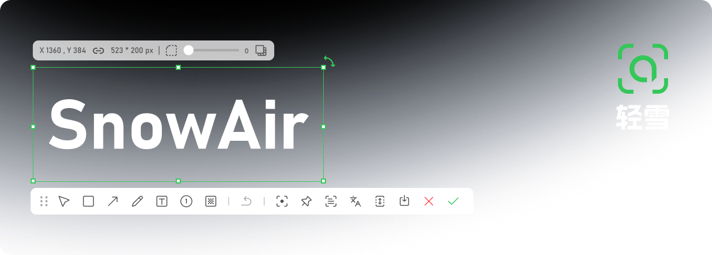

<p align="center">
  <picture>
    <source media="(prefers-color-scheme: light)" srcset="./images/banner.png" />
    
  </picture>
</p>
<h1 align="center">
  <span>SnowAir 轻雪</span>
</h1>
<p align="center">
  <span align="center">SnowAir 轻雪是一套轻量的 Windows 截图与标注工具，覆盖截图、长截图、录屏、OCR 识别、标注与贴图，提供开源免费版与功能更完整的专业版。</span>
</p>
<h3 align="center">
  <a href="#-版本">版本</a>
  <span> · </span>
  <a href="#-安装">安装</a>
  <span> · </span>
  <a href="Native/ARCHITECTURE.md">架构文档</a>
  <span> · </span>
  <a href="https://github.com/CM-idea/SnowAir/releases">发布说明</a>
</h3>

## 🔨 功能

从区域截图、屏幕录制、演示画布到贴图、长截图与文字识别，SnowAir 内置日常截图所需的一整套工具：

|   |   |   |
| --- | --- | --- |
| <picture><source media="(prefers-color-scheme: light)" srcset="images/icon/region.svg" /></picture>&nbsp;&nbsp; 区域截图 | <picture><source media="(prefers-color-scheme: light)" srcset="images/icon/record.svg" /></picture>&nbsp;&nbsp; 屏幕录制 | <picture><source media="(prefers-color-scheme: light)" srcset="images/icon/canvas.svg" /></picture>&nbsp;&nbsp; 演示画布 |
| <picture><source media="(prefers-color-scheme: light)" srcset="images/icon/pin.svg" /></picture>&nbsp;&nbsp; 贴图 | <picture><source media="(prefers-color-scheme: light)" srcset="images/icon/mirror.svg" /></picture>&nbsp;&nbsp; 屏幕镜像* | <picture><source media="(prefers-color-scheme: light)" srcset="images/icon/action.svg" /></picture>&nbsp;&nbsp; 超级动作* |
| <picture><source media="(prefers-color-scheme: light)" srcset="images/icon/long.svg" /></picture>&nbsp;&nbsp; 长截图 | <picture><source media="(prefers-color-scheme: light)" srcset="images/icon/ocr.svg" /></picture>&nbsp;&nbsp; OCR 文字识别 | <picture><source media="(prefers-color-scheme: light)" srcset="images/icon/translate.svg" /></picture>&nbsp;&nbsp; 翻译 |
| <picture><source media="(prefers-color-scheme: light)" srcset="images/icon/rect.svg" /></picture>&nbsp;&nbsp; 矩形 | <picture><source media="(prefers-color-scheme: light)" srcset="images/icon/arrow.svg" /></picture>&nbsp;&nbsp; 箭头 | <picture><source media="(prefers-color-scheme: light)" srcset="images/icon/pen.svg" /></picture>&nbsp;&nbsp; 画笔 |
| <picture><source media="(prefers-color-scheme: light)" srcset="images/icon/text.svg" /></picture>&nbsp;&nbsp; 文字 | <picture><source media="(prefers-color-scheme: light)" srcset="images/icon/number.svg" /></picture>&nbsp;&nbsp; 序号 | <picture><source media="(prefers-color-scheme: light)" srcset="images/icon/mosaic.svg" /></picture>&nbsp;&nbsp; 马赛克 |
| <picture><source media="(prefers-color-scheme: light)" srcset="images/icon/patina.svg" /></picture>&nbsp;&nbsp; 包浆 | <picture><source media="(prefers-color-scheme: light)" srcset="images/icon/watermark.svg" /></picture>&nbsp;&nbsp; 水印 | <picture><source media="(prefers-color-scheme: light)" srcset="images/icon/highlight.svg" /></picture>&nbsp;&nbsp; 高亮 |

此外还有：托盘常驻、全局热键、截图历史、AI大模型*、快捷翻译*、自定义主题等等个性化功能。

> \* 带星号的为专业版功能。

## 🧩 版本

SnowAir 分为两个版本，共享同一套使用体验与功能布局：

| 版本 | 说明 | 获取方式 |
| --- | --- | --- |
| **免费版** | 本仓库维护，源码开放，覆盖截图、标注、长截图、录屏、OCR 与贴图等基础能力 | [GitHub Releases](https://github.com/CM-idea/SnowAir/releases) |
| **专业版** | 独立发行，在免费版基础上提供更完整的功能与持续更新支持 | 官方渠道获取 |

## 📦 安装

以下为软件的获取与运行方式，详细说明见 [`Native/README.md`](Native/README.md)。想快速上手，从以下方式任选其一：
<br/><br/>
<details open>
<summary><strong>从 GitHub Releases 下载</strong></summary>
<br/>

前往 [SnowAir Releases](https://github.com/CM-idea/SnowAir/releases)，展开 **Assets** 下载 `SnowAir.exe`，双击即可运行，无需安装。

</details>

<details>
<summary><strong>便携模式</strong></summary>
<br/>
在 `SnowAir.exe` 同目录放置一个空文件 `config.json`，配置、语言与插件即改从 exe 目录读取；删除该文件即恢复为默认的 `%AppData%\SnowAir\`。

</details>

<details>
<summary><strong>从源码编译</strong></summary>
<br/>

需要 Windows 10 1803+ 与 Visual Studio 2026，工程使用 v145 工具集，安装时需勾选「使用 C++ 的桌面开发」。

首次编译前拉取 GUI 框架 Ling（不在本仓库内）：

```powershell
git clone --depth 1 https://github.com/xland/Ling.git Native/deps/Ling
```

用 Visual Studio 打开 `Native/SnowAir.slnx`，选择 **Release | x64** 生成。

输出：`Native/x64/Release/SnowAir.exe`。

</details>

<details>
<summary><strong>离线文字识别</strong></summary>
<br/>
离线文字识别按需下载，不随安装包内置：在设置中心的「插件集成」下载 PP-OCRv5 方案，再到「功能设置 → 文字识别」启用。

PP-OCRv5 包含飞桨模型与本地推理引擎，可离线识别中英文与界面截图，装好后无需保持联网。

</details>

<details>
<summary><strong>命令行参数</strong></summary>
<br/>
不带参数启动时**只挂托盘图标待命**，不会自动进入截图模式：

```text
SnowAir.exe                     # 托盘待命，默认
SnowAir.exe --auto-quit=true    # 截完即退出
SnowAir.exe --enter=pin         # 框选后直接进入钉图
SnowAir.exe --enter=long        # 长截图
SnowAir.exe --enter=video       # 录屏
SnowAir.exe --enter=tray        # 仅托盘，等同于默认行为
```

截图入口：托盘图标单击，按「功能设置 → 单击托盘执行」选择截图 / 打开设置 / 无操作；
或使用全局热键 `Ctrl+Alt+A`；再次运行 exe 则打开设置中心。

</details>

## ✨ 新特性

要了解最新变化，请查看 [发布说明](https://github.com/CM-idea/SnowAir/releases)。

## 🛣️ 路线图

持续打磨标注与录屏能力，完善 OCR / 翻译服务集成，并推进设置中心与工具栏外观编辑器。

## ❤️ SnowAir 社区

SnowAir 由 [CM-idea](https://github.com/CM-idea) 维护，欢迎通过 [Issue](https://github.com/CM-idea/SnowAir/issues) 反馈问题或提出建议。

## 贡献

本项目欢迎各类贡献，除了功能开发与 Bug 修复，也包括体验设计、文档完善与问题反馈。
当前开源的免费版源码位于本仓库，开始动手前建议先阅读 [`Native/ARCHITECTURE.md`](Native/ARCHITECTURE.md) 了解整体结构。

## 隐私声明

SnowAir 是本地工具，默认不上传任何截图或文本；联网仅用于检查更新、在线 OCR / 翻译服务与插件下载。

[releases-link]: https://github.com/CM-idea/SnowAir/releases
[issues-link]: https://github.com/CM-idea/SnowAir/issues